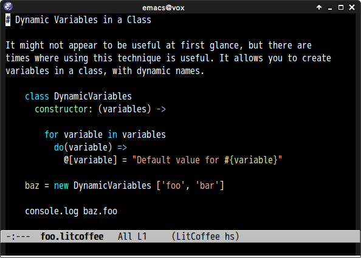

# literate-coffee-mode.el

## Introduction
`literate-coffee-mode.el` is a major-mode for [Literate CoffeeScript](http://coffeescript.org/#literate)

## Screenshot

## Installation

You can install `literate-coffee-mode` from MELPA with package.el

## Dependency

* [coffee-mode](https://github.com/defunkt/coffee-mode)
